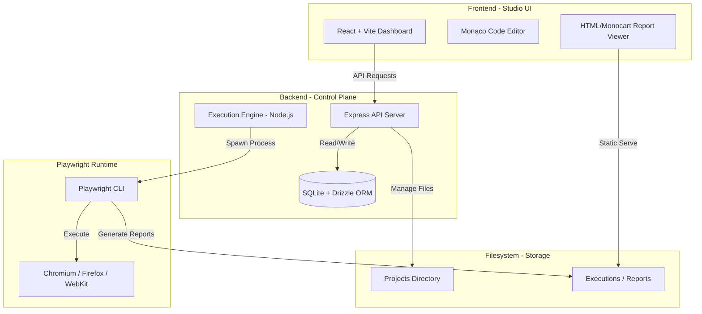

# 🎭 Playwright Studio

> **The ultimate web-based control plane for Playwright tests.**

Playwright Studio is a centralized testing platform designed to simplify the recording, management, and execution of automated user journeys. It provides a visual interface for managing test suites, triggering parallel runs, and analyzing rich execution reports—all from a single, beautiful dashboard.

---

## 🏗️ Architecture

Playwright Studio follows a distributed architecture consisting of a centralized control plane (The Studio), specialized recorder tools, and local execution bridges.



---

## ✨ Key Features

- **🚀 Multi-File Test Execution**: Select multiple test files and run them in a single batch with full parallelization.
- **📁 Integrated File Manager**: Browse, edit, and manage your Playwright test repository directly in the browser using a Monaco-based editor.
- **📊 Detailed Execution History**: Track every run with status, duration, and full command-line logs.
- **📑 Rich Reporting**: Built-in support for **Monocart** and **HTML** reporters with direct viewing from the history tab.
- **🔄 Local Sync**: Automatically discovers and synchronizes your existing Playwright project folders into the database.
- **🛡️ Secure Access**: Token-based authentication and Role-Based Access Control (RBAC) foundation.

---

## 🛠️ Tech Stack

- **Frontend**: React 18, Vite, Tailwind CSS, Lucide Icons, Radix UI (Shadcn), Monaco Editor.
- **Backend**: Node.js, Express, TypeScript.
- **Database**: SQLite (via `better-sqlite3`), Drizzle ORM.
- **Execution**: Playwright (Core Engine).
- **Communication**: WebSockets (Real-time logs) & REST API.

---

## 🚀 Getting Started

### Prerequisites

- **Node.js**: v18 or later.
- **Playwright Dependencies**: Ensure browsers are installed (`npx playwright install`).

### Setup

1. **Clone the repository**:
   ```bash
   git clone https://github.com/ITEchGenie/playwright-studio.git
   ```

2. **Install Dependencies**:
   ```bash
   npm install
   ```

3. **Configure Environment**:
   Create a `.env` file in `playwright-studio/server`:
   ```env
   PORT=3000
   PROJECTS_BASE_PATH=D:/tmp/playwright-studio/projects
   EXECUTIONS_BASE_PATH=D:/tmp/playwright-studio/executions
   ```

4. **Initialize Database**:
   The server automatically applies migrations on startup, but you can manually sync the schema:
   ```bash
   cd playwright-studio/server
   npm run db:push
   ```

5. **Start Development**:
   From the root:
   ```bash
   npm run dev
   ```

---

## 📁 Project Structure

```text
├── playwright-studio/
│   ├── client/           # React + Vite Frontend
│   └── server/           # Express + Drizzle Backend
├── playwright-studio-agent/ # Local execution bridge (CLI Agent)
├── playwright-studio-extension/ # Chrome Recorder Extension
└── tests/                # Core test suite
```

---

## 📜 License

This project is licensed under the MIT License. See [LICENSE](LICENSE) for details.
