<p align="center">
  
</p>

# 🎭 Playwright Studio

> **The ultimate web-based control plane for Playwright tests.**

Playwright Studio is a centralized testing platform designed to simplify the recording, management, and execution of automated user journeys. It provides a visual interface for managing test suites, triggering parallel runs, and analyzing rich execution reports—all from a single, beautiful dashboard.

---

## 🏗️ Architecture

Playwright Studio follows a distributed architecture consisting of a centralized control plane (The Studio), specialized recorder tools, and local execution bridges.

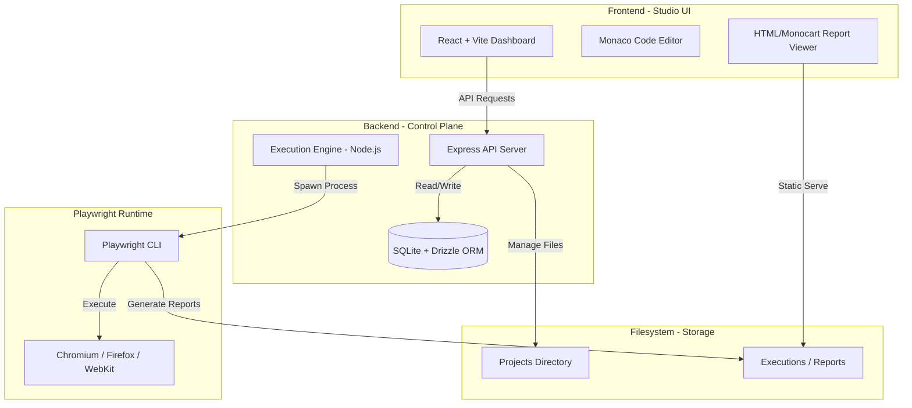

---

## ✨ Key Features

- **🚀 Multi-File Test Execution**: Select multiple test files and run them in a single batch with full parallelization.
- **📁 Integrated File Manager**: Browse, edit, and manage your Playwright test repository directly in the browser using a Monaco-based editor.
- **📊 Detailed Execution History**: Track every run with status, duration, and full command-line logs.
- **📑 Rich Reporting**: Built-in support for **Monocart** and **HTML** reporters with direct viewing from the history tab.
- **🔄 Local Sync**: Automatically discovers and synchronizes your existing Playwright project folders into the database.
- **🛡️ Secure Access**: Token-based authentication and Role-Based Access Control (RBAC) foundation.
- **📅 Advanced Scheduling**: Schedule tests to run automatically with cron-like precision.

---

## 📸 Visual Tour

### 🔐 Multi-Provider Login
The entry point supporting OAuth and local administrative access.
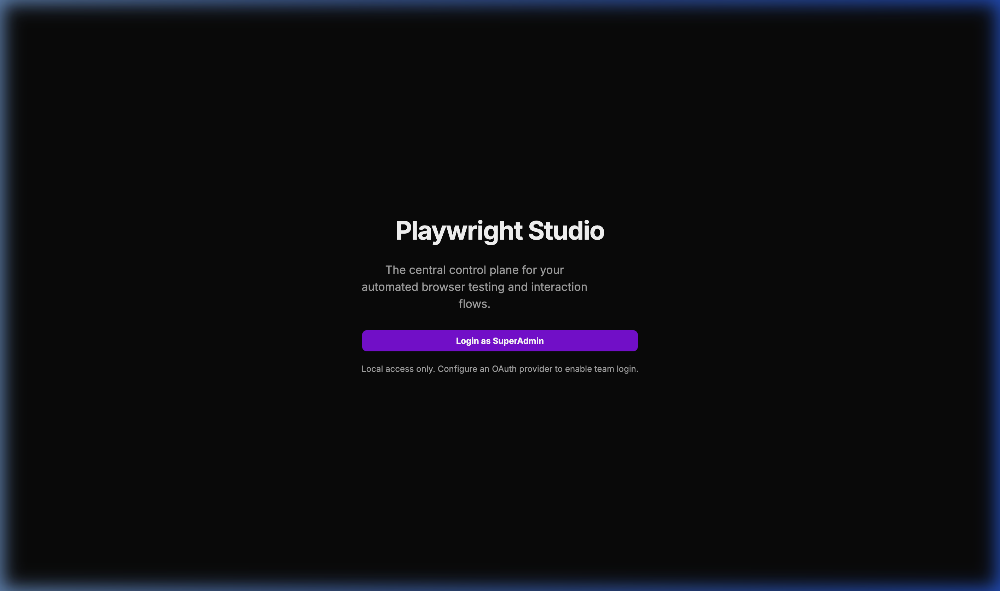

### 📂 Project Workspace
A bird’s-eye view of all your integrated Playwright projects.
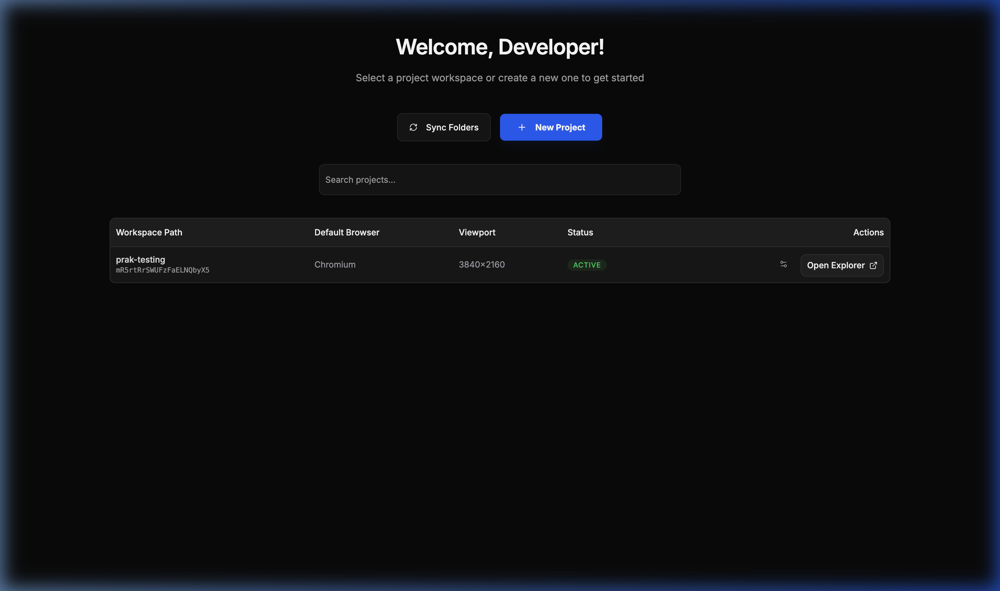

### 🔍 User Journey Explorer
The central hub for browsing and managing test specifications.
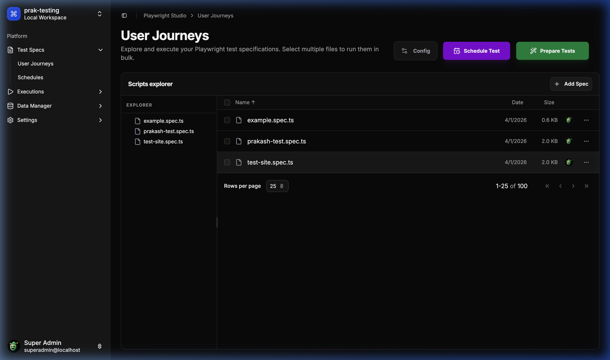

### 🧪 Runner & Prepare
Interactive drawer for preparing and selecting tests for execution.
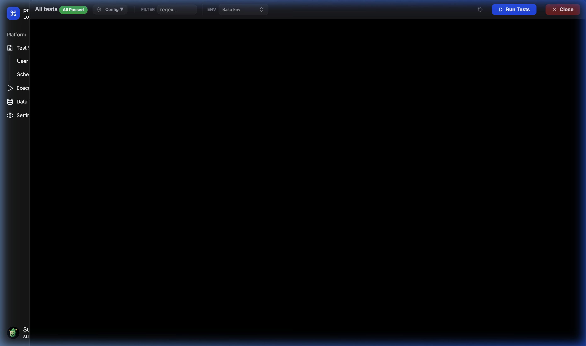

### ⚡ Live Execution Logs
Real-time feedback and execution logs for parallel test runs.
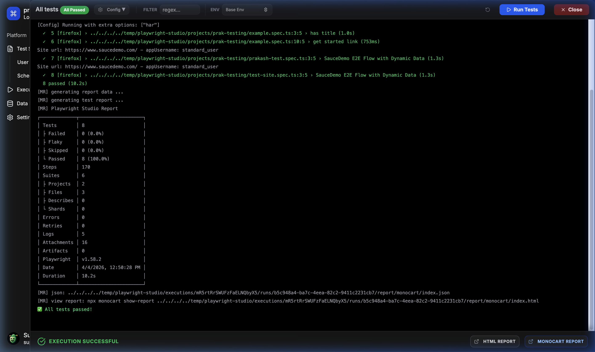

### 📅 Advanced Scheduler
Easily configure recurring test runs for continuous monitoring.
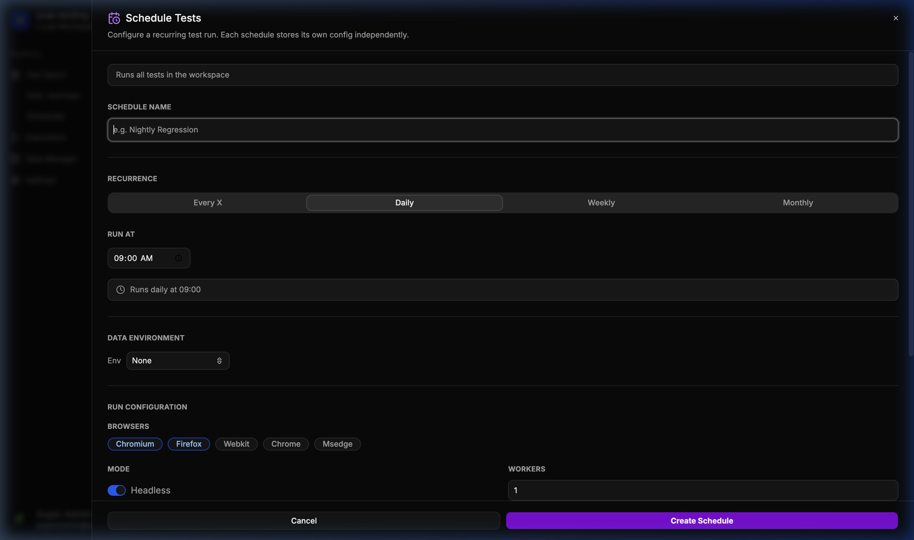

### 📊 Historical Run Analytics
Complete history of every execution with direct access to HTML reports.
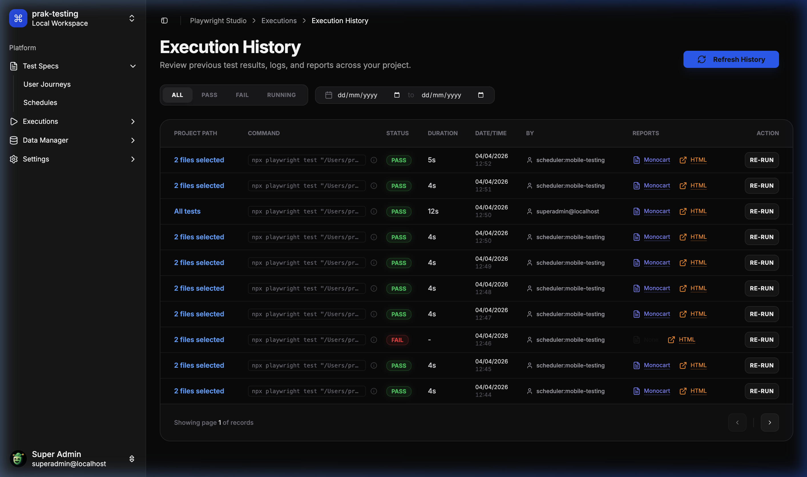

### 📦 Data Manager - Templates
Define schema-based data templates for your user journeys.
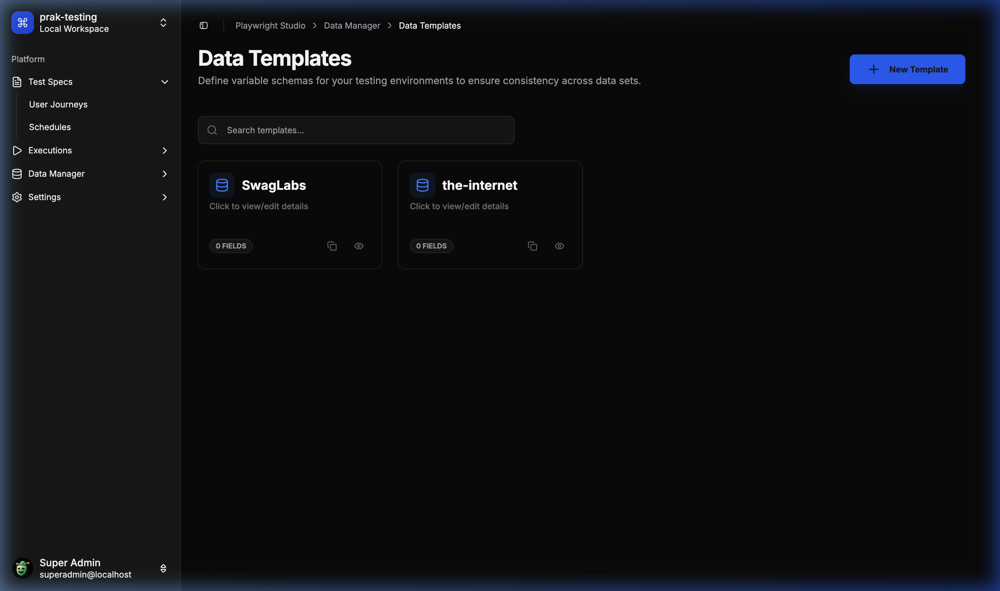

### 🌐 Environment & Datasets
Manage environment-specific data overrides effortlessly.
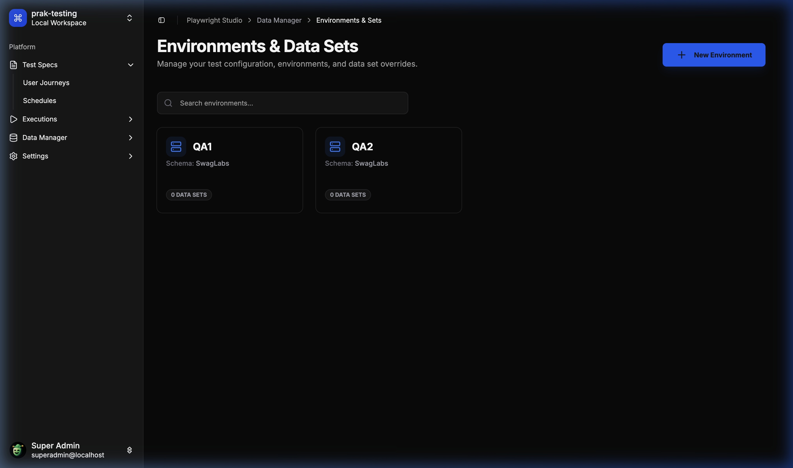

### ⚙️ Global Configuration
Fine-tune project-level Playwright settings from the UI.
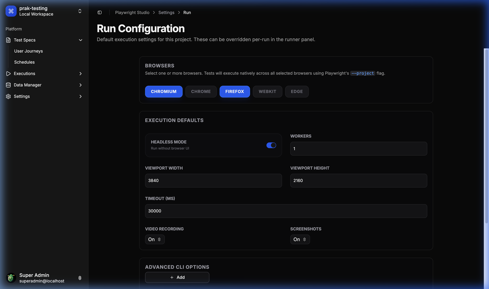

---

## 🛠️ Tech Stack

- **Frontend**: React 18, Vite, Tailwind CSS, Lucide Icons, Radix UI (Shadcn), Monaco Editor.
- **Backend**: Node.js, Express, TypeScript.
- **Database**: SQLite (via `better-sqlite3`), Drizzle ORM.
- **Execution**: Playwright (Core Engine).
- **Communication**: WebSockets (Real-time logs) & REST API.

---

## 🚀 Getting Started

### Prerequisites

- **Node.js**: v18 or later.
- **Playwright Dependencies**: Ensure browsers are installed (`npx playwright install`).

### Setup

1. **Clone the repository**:
   ```bash
   git clone https://github.com/ITEchGenie/playwright-studio.git
   ```

2. **Install Dependencies**:
   ```bash
   npm install
   ```

3. **Configure Environment**:
   Create a `.env` file in `playwright-studio/server`:
   ```env
   PORT=3000
   PROJECTS_BASE_PATH=D:/tmp/playwright-studio/projects
   EXECUTIONS_BASE_PATH=D:/tmp/playwright-studio/executions
   ```

4. **Configure OAuth (Optional)**:
   To enable Git integration and OAuth login, configure OAuth providers in your `.env` file:
   
   **GitLab OAuth**:
   ```env
   GITLAB_CLIENT_ID=your_gitlab_client_id
   GITLAB_CLIENT_SECRET=your_gitlab_client_secret
   GITLAB_OAUTH_SCOPE="api read_user openid email profile read_repository write_repository"
   ```
   
   **GitHub OAuth**:
   ```env
   GITHUB_CLIENT_ID=your_github_client_id
   GITHUB_CLIENT_SECRET=your_github_client_secret
   GITHUB_OAUTH_SCOPE="read:user user:email repo"
   ```
   
   **Required OAuth Scopes**:
   - **GitLab**: `read_user openid email profile read_repository write_repository`
     - `api`, `read_repository` and `write_repository` are required for Git operations (import projects, sync files, push changes)
   - **GitHub**: `read:user user:email repo`
     - `repo` scope is required for full repository access (read and write operations)
   
   **Setting up OAuth Apps**:
   - **GitLab**: Create an OAuth application at `https://gitlab.com/-/profile/applications`
     - Set redirect URI to: `http://localhost:5173/apis/auth/callback/gitlab` (adjust for production)
     - Select the required scopes listed above
   - **GitHub**: Create an OAuth app at `https://github.com/settings/developers`
     - Set authorization callback URL to: `http://localhost:5173/apis/auth/callback/github` (adjust for production)
     - Request the required scopes listed above

5. **Initialize Database**:
   The server automatically applies migrations on startup, but you can manually sync the schema:
   ```bash
   cd playwright-studio/server
   npm run db:push
   ```

6. **Start Development**:
   From the root:
   ```bash
   npm run dev
   ```

---

## 📁 Project Structure

```text
├── playwright-studio/
│   ├── client/           # React + Vite Frontend
│   └── server/           # Express + Drizzle Backend
├── playwright-studio-agent/ # Local execution bridge (CLI Agent)
├── playwright-studio-extension/ # Chrome Recorder Extension
└── tests/                # Core test suite
```

---

## 🔗 Git Integration

Playwright Studio supports importing projects directly from GitLab or GitHub repositories, syncing files on demand, and pushing edits back with a commit message — all without needing a local `git` binary.

### Tested Providers

| Provider | Status |
|----------|--------|
| GitLab   | ✅ Tested |
| GitHub   | 🧪 Implemented, community testing welcome |

> **Note:** Git integration has been primarily tested with **GitLab**. If you run into issues with GitHub or any other edge cases, please [open a ticket here](https://github.com/ITechGenie/playwright-studio/issues/new) with steps to reproduce.

### Required OAuth Scopes

**GitLab** — your OAuth app must have these scopes:
```
api read_api read_user openid email profile read_repository write_repository
```

**GitHub** — your OAuth app must have:
```
read:user user:email repo
```

### Setup

Add these to your `playwright-studio/server/.env`:

```env
# GitLab
GITLAB_CLIENT_ID=your_client_id
GITLAB_CLIENT_SECRET=your_client_secret

# GitHub
GITHUB_CLIENT_ID=your_client_id
GITHUB_CLIENT_SECRET=your_client_secret
```

Create your OAuth apps:
- **GitLab**: `https://gitlab.com/-/profile/applications` — set redirect URI to `http://localhost:5173/apis/auth/callback/gitlab`
- **GitHub**: `https://github.com/settings/developers` — set callback URL to `http://localhost:5173/apis/auth/callback/github`

> If you re-configure scopes on an existing OAuth app, you must **log out and log back in** to get a new token with the updated scopes.

---

## 🐛 Reporting Issues

Found a bug or something not working as expected? Please [open an issue](https://github.com/ITechGenie/playwright-studio/issues/new) and include:
- Steps to reproduce
- Expected vs actual behaviour
- Browser and OS
- Any relevant server/console logs

---

## 📜 License

This project is licensed under the MIT License. See [LICENSE](LICENSE) for details.
