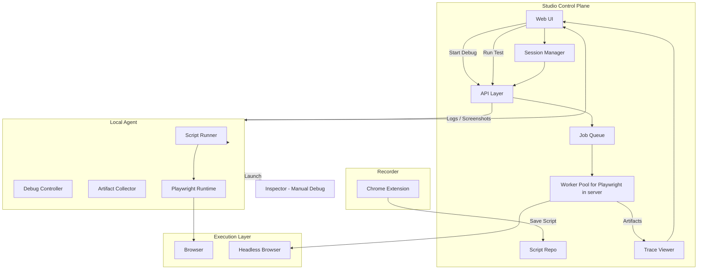

# Playwight Studio

## 🧪 Playwright-Based Testing Studio – Architecture Plan

## 🎯 Objective

Build a **testing platform** that supports:

- Recording user journeys via Chrome extension
- Storing reusable Playwright scripts
- Running tests:
  - Locally (debug / inspector mode)
  - In background (headless, multi-user)
- Visualizing results (trace, logs, screenshots)
- Supporting editable debug sessions without losing state

---

# 🧱 Core Architecture

## 1. Studio (Control Plane)

### Responsibilities

- Web UI for managing flows
- Script repository (source of truth)
- Session management (debug state)
- Trace & artifact visualization
- API layer (control plane)
- Job queue for background execution
- Worker pool for headless Playwright runs

---

## 2. Local Agent (Execution Bridge)

### Responsibilities

- Pull scripts from Studio
- Execute Playwright locally
- Support debug mode (step execution)
- Launch Inspector (manual debugging)
- Stream logs, screenshots, and results back

---

## 3. Recorder (Chrome Extension)

### Responsibilities

- Capture user interactions
- Generate Playwright-compatible scripts
- Send recorded flows to Studio

---

## 4. Execution Modes

### A. Debug Mode (Local)

Studio → Agent → Playwright → Browser

- Interactive
- Step-by-step execution
- Supports inspector (manual only)

---

### B. Headless Mode (Background)

Studio → Job Queue → Worker → Playwright (headless)


- Multi-user
- Scalable
- Stores execution history

---

## 5. Session vs Run

### Debug Session (mutable)

```json
{
  "sessionId": "sess-123",
  "scriptId": "flow-1",
  "currentStep": 4,
  "overrides": {
    "step-4.selector": "#updated"
  }
}
```

## Execution Run (immutable)

```json
{
  "runId": "run-456",
  "scriptId": "flow-1",
  "status": "passed",
  "artifacts": {
    "trace": "trace.zip",
    "logs": "logs.json"
  }
}
```

## 🔄 End-to-End Flow



## 🧠 Final Mental Model

Studio  = Brain (control + UI + storage) + Workers = Muscle (scale)
Agent   = Hands (execution)
Extension = Recorder 

Studio (playwright-studio) - a web application (react +  vite + shadcn) running in a remote server. This will be running a playwright instance controller via workers. 
Chrome extension (playwright-studio-extension) running in developer browser 
An agent (playwright-studio-agent) running in developer system all connected to the studio - This agent will intract with native playwright tools in developer system to trigger trace inspector etc


Playwright Studio Development Plan
This document outlines the detailed development plan for the Playwright Studio suite based on your architecture document (
plan.md
). We are parking the Playwright MCP AI integration for now to focus entirely on building a robust Studio UI, the Functional APIs, and the Authentication/Token architecture required for the Agent and Extension.

User Review Required
IMPORTANT

Please review the updated architecture, specifically the Authentication Strategy (GitLab OIDC + API Keys) and the component breakdown. Let me know if you approve this plan or if there are specific adjustments you would like to make before we begin execution.

Proposed Architecture & Authentication Strategy
1. Authentication Strategy (Studio vs. Agents/Extensions)
Since the Studio acts as the control plane, it requires strict authentication.

Human Users (Studio UI): Authenticated using Generic OAuth/OIDC (e.g., using Auth.js / NextAuth or lucia-auth). We will configure it to support any generic provider, with GitLab used primarily for testing.
Programmatic Access (Agent & Extension): Authenticated using Personal Access Tokens (Opaque API Keys).
Flow: A user logs into the Studio via GitLab. They go to a "Developer Settings" page and generate a token. The backend generates a secure random string (using standard crypto), hashes it, stores the hash in the DB, and shows the raw token to the user once.
The developer copies this token into their Extension settings or Agent CLI configuration.
The Extension and Agent send this token via the Authorization: Bearer <token> header for REST API calls or during WebSocket handshakes.
2. Repository Strategy (Monorepo)
A Monorepo setup using Turborepo and pnpm (or npm workspaces) to ensure seamless code sharing.

Structure:

apps/studio/: React + Vite + shadcn web app + Node.js backend.
apps/extension/: Chrome Extension (Manifest V3, Vite, React).
apps/agent/: Node.js CLI tool running locally on developer machines.
packages/shared/: Shared types (Zod schemas) for API boundaries, script models, and communication events.
3. Component Breakdown & Functional APIs
A. Playwright Studio (Control Plane)
Frontend: React, Vite, Tailwind CSS, shadcn/ui.
Key Views: Login Page (GitLab single-sign-on), Dashboard, Flow/Script Editor, Run History, Developer Settings (to generate API tokens), and Trace Viewer.
Backend: Node.js (e.g., Express or Next.js API Routes). WebSockets (socket.io or ws) for real-time agent/worker communication.
Database: Configurable to use SQLite (Default) or PostgreSQL via a modern ORM like Drizzle ORM or Prisma to abstract the SQL dialect and allow seamless switching.
Core APIs:
POST /api/auth/[...provider] - Generic OIDC callback (e.g., GitLab).
POST /api/tokens - Generate new agent/extension API tokens.
POST /api/scripts - Extension uploads recorded flows here.
GET /api/scripts/:id - Agent pulls script to execute.
POST /api/runs/:runId/logs - Agent streams logs/results.
B. Chrome Extension (Recorder)
Stack: Vite, React, Chrome Manifest V3.
Features:
Popup UI: Input field for the API Token and Studio URL.
Background Worker: Manages state and communicates with the Studio API using the token.
Content Scripts: Injects recording tools, tracks DOM interactions, translates them to Playwright DSL.
C. Local Agent (Execution Bridge)
Stack: Node.js CLI, playwright, WebSocket client.
Features:
Configured with STUDIO_URL and STUDIO_API_TOKEN.
Connects to Studio via WebSocket to listen for execution commands.
Pulls target scripts, launches Playwright locally (headed for debug, headless for background), attaches the Playwright Inspector if needed.
Streams execution steps, logs, and trace artifacts back to the Studio server.
4. Development Phases
Phase 1: Foundation & Authentication API

Generate Monorepo structure.
Setup PostgreSQL DB schema (Users, API Tokens, Scripts).
Implement GitLab OIDC Auth for the web interface.
Implement API Token generation and middleware validation for the extensions/agents.
Phase 2: Studio Web Interface & Extension MVP

Scaffold React + shadcn Studio UI (Dashboard & Token Management).
Create Chrome Extension MVP with token configuration to record basic interactions and sync to the Studio.
Phase 3: Interactive Agent & WebSocket Layer

Build the Node.js Local Agent CLI.
Setup WebSocket layer on the Studio backend for live duplex communication.
Enable the Agent to pull scripts and perform headless execution, validating against the token.
Phase 4: Execution Streaming & Trace Viewer

Stream test steps/logs back to the Studio UI in real-time.
Store Playwright trace zips and embed the Playwright Trace Viewer in the Studio interface.
Verification Plan
Automated Tests
API Tests to verify that requests without valid API Keys are rejected (401 Unauthorized), and valid keys parse to the correct user context.
Zod schema validation tests for payloads between components.
Manual Verification
Auth Flow Walkthrough: Log in via GitLab OIDC -> Generate API Token in settings -> Authenticate Extension with token.
End-to-End Execution Flow: Record a simple flow via Extension -> Save to Studio. Start Local Agent with Token -> Trigger execution from Studio UI -> Watch local Playwright spin up and stream results back via WebSockets.


For testing 

SauceDemo (Swag Labs) → https://www.saucedemo.com/
The Internet (Herokuapp) → https://the-internet.herokuapp.com/
DemoQA → https://demoqa.com/
Automation Practice (My Store) → http://automationpractice.com/
OrangeHRM Demo → https://opensource-demo.orangehrmlive.com/
Parabank → https://parabank.parasoft.com/
UI Testing Playground → https://uitestingplayground.com/
jQuery UI Demos → https://jqueryui.com/
Expand Testing Practice → https://practice.expandtesting.com/
Playwright A11y Demo → https://playwright-fyi.github.io/playwright-a11y-demo/