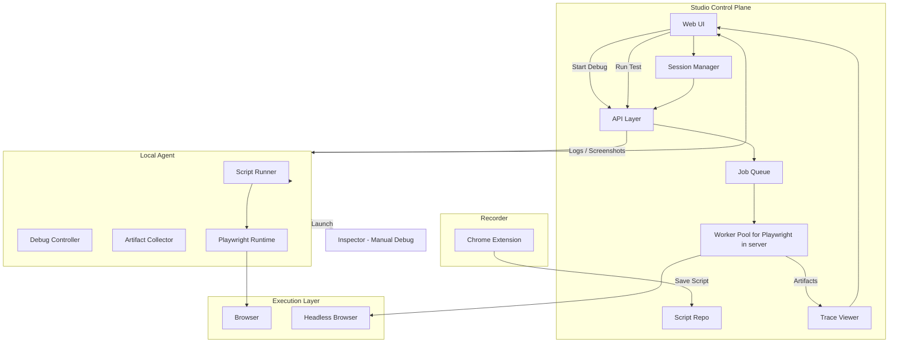

# Playwight Studio

## 🧪 Playwright-Based Testing Studio – Architecture Plan

## 🎯 Objective

Build a **testing platform** that supports:

- Recording user journeys via Chrome extension
- Storing reusable Playwright scripts
- Running tests:
  - Locally (debug / inspector mode)
  - In background (headless, multi-user)
- Visualizing results (trace, logs, screenshots)
- Supporting editable debug sessions without losing state

---

# 🧱 Core Architecture

## 1. Studio (Control Plane)

### Responsibilities

- Web UI for managing flows
- Script repository (source of truth)
- Session management (debug state)
- Trace & artifact visualization
- API layer (control plane)
- Job queue for background execution
- Worker pool for headless Playwright runs

---

## 2. Local Agent (Execution Bridge)

### Responsibilities

- Pull scripts from Studio
- Execute Playwright locally
- Support debug mode (step execution)
- Launch Inspector (manual debugging)
- Stream logs, screenshots, and results back

---

## 3. Recorder (Chrome Extension)

### Responsibilities

- Capture user interactions
- Generate Playwright-compatible scripts
- Send recorded flows to Studio

---

## 4. Execution Modes

### A. Debug Mode (Local)

Studio → Agent → Playwright → Browser

- Interactive
- Step-by-step execution
- Supports inspector (manual only)

---

### B. Headless Mode (Background)

Studio → Job Queue → Worker → Playwright (headless)


- Multi-user
- Scalable
- Stores execution history

---

## 5. Session vs Run

### Debug Session (mutable)

```json
{
  "sessionId": "sess-123",
  "scriptId": "flow-1",
  "currentStep": 4,
  "overrides": {
    "step-4.selector": "#updated"
  }
}
```

## Execution Run (immutable)

```json
{
  "runId": "run-456",
  "scriptId": "flow-1",
  "status": "passed",
  "artifacts": {
    "trace": "trace.zip",
    "logs": "logs.json"
  }
}
```

## 🔄 End-to-End Flow



## 🧠 Final Mental Model

Studio  = Brain (control + UI + storage) + Workers = Muscle (scale)
Agent   = Hands (execution)
Extension = Recorder 

Studio (playwright-studio) - a web application (react +  vite + shadcn) running in a remote server. This will be running a playwright instance controller via workers. 
Chrome extension (playwright-studio-extension) running in developer browser 
An agent (playwright-studio-agent) running in developer system all connected to the studio - This agent will intract with native playwright tools in developer system to trigger trace inspector etc